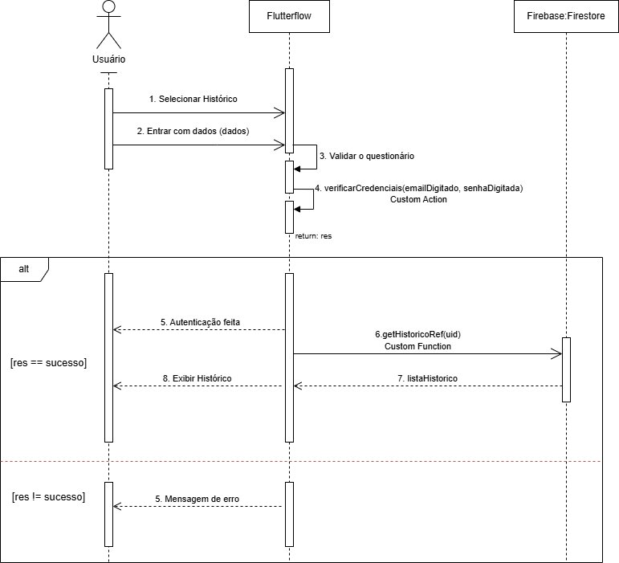
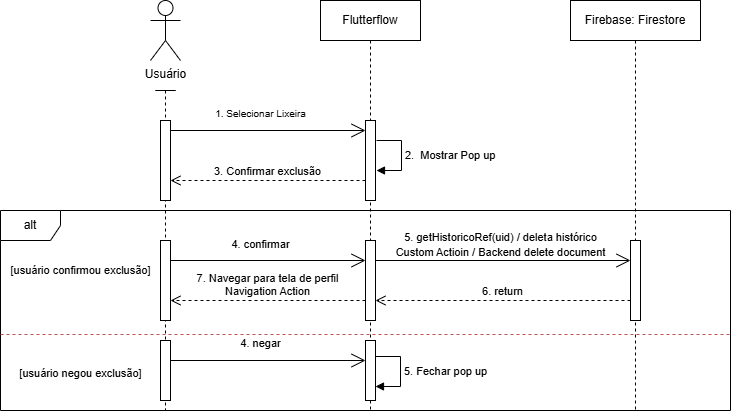
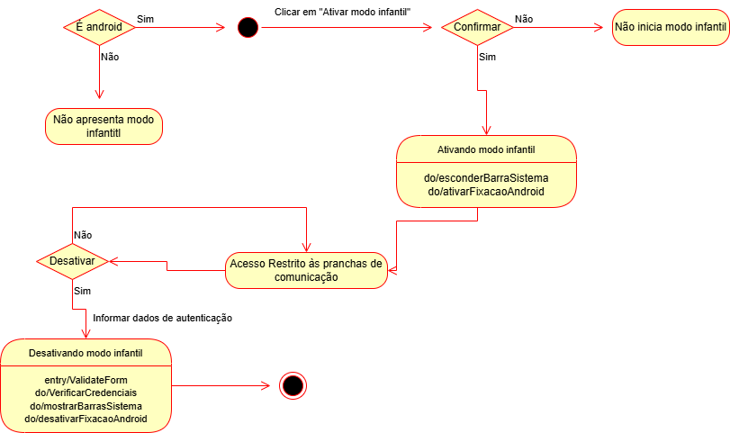

# 📊 Papuguinho - Documentação Arquitetural | Architectural Documentation

---

Este repositório centraliza a documentação visual e os diagramas de fluxo do ecossistema **Papuguinho**.

### Diagramas de Sequência: 
`1. Criar Pictograma:` Detalha o processo de criação de um pictograma, desde a interface até o backend.

`2. Acessar Histórico:` Detalha o processo de acesso ao histórico e sua consulta ao banco de dados. 

`3. Deletar Histórico:` Detalha o processo de deletar o histórico. 

### Diagramas de Estado: 

`1. Modo Infantil:` Detalha o estado de ativação e desativação do modo infantil. 

