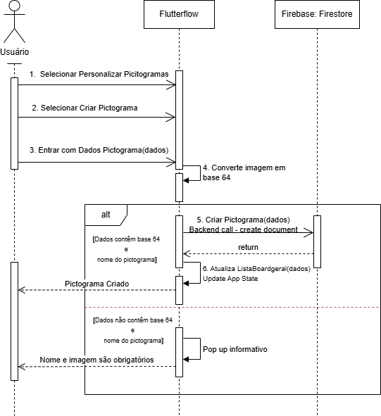

# 📊 Papuguinho - Documentação Arquitetural | Architectural Documentation

---

Este repositório centraliza a documentação visual e os diagramas de fluxo do ecossistema **Papuguinho**.

### Diagramas de Sequência: 
`1. Criar Pictograma:` Detalha o processo de criação de um símbolo, desde a interface até o backend.

